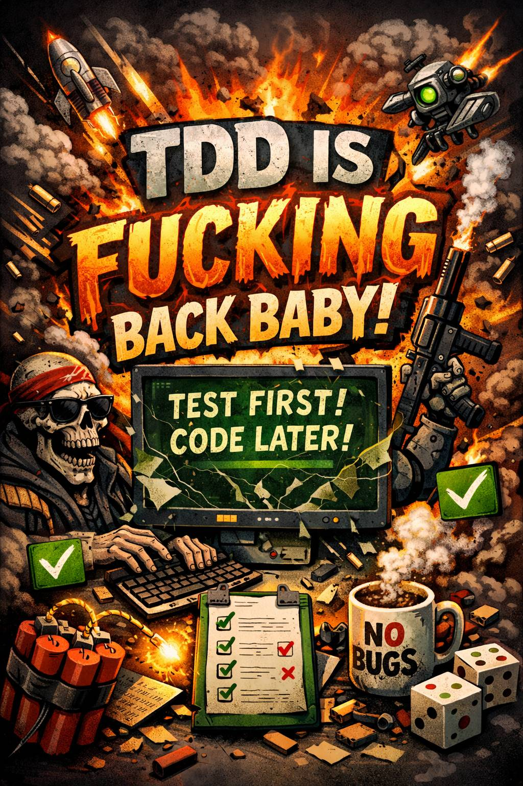

---
authors:
- mike
tags:
- tdd
- agentic coding
- llms
date: 2026-02-19
---

# TDD is back baby!

Sorry for the AI slop image, but I thought Chatgippity captured my thoughts pretty well with this one.

Reading the [report from The future of software engineering retreat](https://www.thoughtworks.com/content/dam/thoughtworks/documents/report/tw_future%20_of_software_development_retreat_%20key_takeaways.pdf) I was reminded that I've been meaning to write about TDD when vibe coding. The retreat report mentions:

> TDD as the strongest form of prompt engineering

If you don't know it by now, testing is how you get LLMs to build working software. Sometimes it's not just your actual test cases, but it's also the compiler and even just instructions to the _machine_ (via Claude Code or Codex or whatever). Without a feedback loop you are fucked and wasting time and tokens.

## You said something about TDD

Yeah, TDD, Test Driven Development is an awesome design practice. If your code is hard to test, it's probably shit code and not maintainable. Also code that does not have tests is legacy code[^1] so testing is important if you want to enable changing (maintaining) software. This fact does not change whether you are coding by hand or vibe coding.

The problem with TDD though is that it is quite expensive. When I'm writing code in TDD style it takes a lot longer, but the code becomes much better. Well, perhaps an exception to the rule is when you are writing something quite complicated and it's just worth testing it in small iterations to see if it comes out correctly bit by bit. But for "trivial"/bulk code it is pretty slow often to write purely in TDD fashion, or maybe I'm just shit at coding (I am).

Why is TDD back then? Well obviously Claude Code can write tests quickly, BUT! Claude Code is also a fucker that writes shitty tests. It likes to test the implementation, not the behaviour, like a total newb. I haven't yet tested this much but I find that reading and contributing to the tests is really the best use of my time when vibe coding something. I still don't really write all the test cases, I've been almost pseudocoding and then letting the LLM do the hard work, it gets it right when you tell it what to test and a bit how to so it doesn't create stupid mocks everywhere.

## Write the test first

Ok, so the important thing with TDD is to write the test first. And this is my point with agentic coding workflow too, you progress quicker if you just write the tests first because often YOU haven't thought of something yet, and by pseudocoding on the tests you are exploring the solution as well. The thing is, if you don't tell the LLM a thing, it won't code up the thing. Sure, sometimes Claude will figure out some small things you forgot to mention, but when it comes to your features it won't really "fill in the blanks". The fucker won't even ask you about obvious gaps.

## Beyond unit tests

One example that Claude seems to get wrong currently is e2e backend and frontend work. In a backend-driven application, I still found that I have to tell Claude to add things to the UI as well or it won't consistently do it. In my experience testing frontend has always been too much work, but maybe it's not if I don't write the tests? This is what I will start experimenting with this project I've been vibing on. Because I think it's actually _slowing_ the development that the frontend doesn't have tests and I cannot make a test specification that includes e2e flows.

I think this will go beyond unit tests, and even TDD, what I have been thinking is state machines (also mentioned in the retreat report) as a way of having some shared ground and understanding of the project between me and the machine. Because I sure as hell ain't gonna read all that code. Honestly, I don't even know the programming language!

[^1]: Author of "Working Effectively With Legacy Code", Michael Feathers defines Legacy Code like so: "To me, legacy code is simply code without tests."

