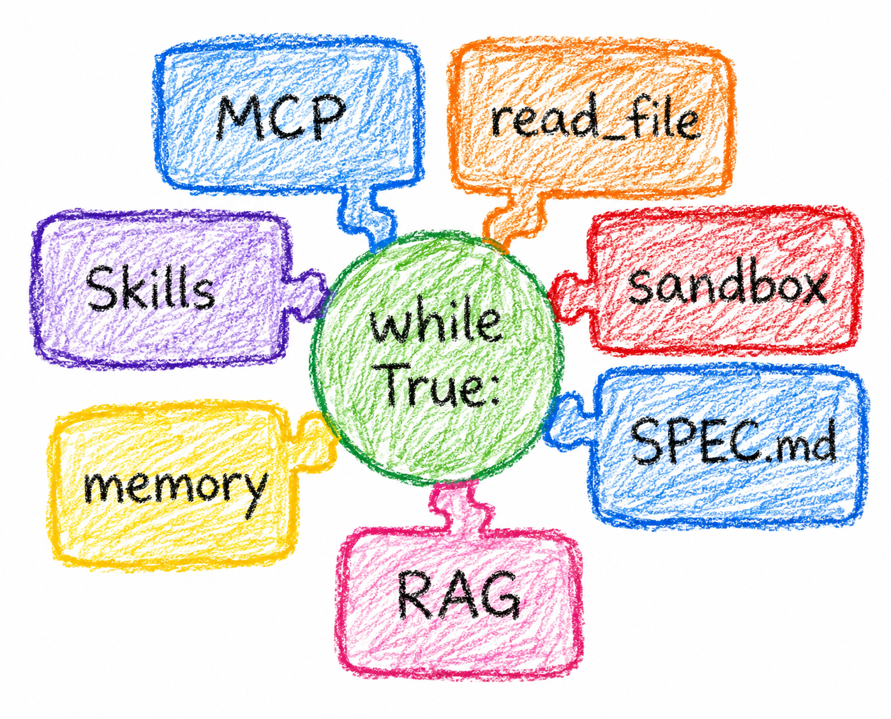

---
authors:
- mike
tags:
- hard way
- agentic coding
- llms
date: 2026-07-05
---

# Agent the Hard Way: Why and what?

I am starting a new project, and at the same time writing about it each step of the way. This means there will be a series of blog posts under this "Agent the Hard Way" umbrella.

I was thinking of writing a book, not a _real_ book. Just instead of blog posts create an open static site with [mdbook](https://github.com/rust-lang/mdBook/) or something similar. But ultimately that's not what I need right now, I just want to focus on hacking the thing together and writing as a way of learning instead of focusing on being actually pedagogical in the content. I'll just write this series like I'm writing for my self, somebody who wants to learn about the topic and know it deeply. Unlike typical blog posts though, I do plan on updating the posts if I discover something that I would like to correct/improve upon. Like adding examples or even major refactoring on the content.

Why am I building it? Well I find that a lot of toil can be handled by agents in my daily work, so I see value in the technology. And beyond software development and delivery related tasks there's much much more potential I see. Like diagnosing issues and troublshooting much more efficiently. More philosophically, it's cool computer has new tricks. We can solve problems we couldn't before. I find joy in the work and I'm optimistic local AI models will become so good we can do this without all the fucking data centers.

## Agent the Hard Way

First things first, the name is of course a reference to the legendary [Kubernetes the hard way](https://github.com/kelseyhightower/kubernetes-the-hard-way) by Kelsey Hightower. But the project isn't going to be quite the same as that one. I just really think the name is fun, props to Kelsey!

So what it is? Time will tell in more detail, but I set out to deploy a **coding agent into production** as the end goal. I will self-host the agent on a spare Intel NUC I have, or I will deploy it on a cheap VPS, depends a bit how I want to interact with it. I ain't gonna open my home network to the interwebs for this.

## Coding Agent

Unfortunately, there isn't really a good _coding agent_ you can just deploy. Damn, so I'll just write one then, easy enough. Except it's not that easy when I think about it. To build an agent you build a while loop that exists when the LLM does not want to do more tool calls, but wait, where does that loop run? How does it access the repo? Where is the session stored and how is it triggered? How does it build the project if it's not on my laptop? (goal of the project is **production**, my laptop does not belong in prod)

### Harness

So looking at things that exist we have things that you run locally like:

- codex
- claude code
- pi.dev

Yeah, out of those you can perhaps choose Pi and extend your way into happiness. These are called **Agent Harnessess** these days.

Then we also have of course things that don't run on your laptop, like:

- [CloudFlare Agents](https://agents.cloudflare.com/)
- [Google Gemini Enterprise Agent Platform](https://cloud.google.com/gemini-enterprise/agents) (what a name...?)
- [Claude Managed Agents](https://claude.com/blog/claude-managed-agents)

In the OSS world there does not seem to be a project that is winning (AFAIK), but surely there are hundreds if not thousands of projects already being built trying to become the Kubernetes of Agent Platforms. So "Agent the Hard Way" having some reference to Kubernetes feels actually pretty fair, just like Kubernetes once was competing with Mesos and Docker Swarm before becoming dominant in the market.

In fairness, I will mention that there is the [Open SWE](https://github.com/langchain-ai/open-swe) project from LangChain that is perhaps closest to something I could use right away. But I don't think there is mass adoption of it, so I don't see point focusing on that instead of just writing something myself and learning even more. :)

## What goes into a Harness?

I made a small picture of the things that _could_ go into a coding agent harness for example:

These are some of the things that will get dedicated posts, and some will not. I'll start with the very basics though.

## What's the angle?

Ok so what will I do differently? Well for starters, I want to create a meta harness. Not just a harness like Claude Code (a coding agent CLI for local use), but a meta harness that can be used (in code) to create agents of all kinds of shapes and for all kinds of uses.

I will be using Go as the programming language. I think the code is readable enough if you don't know Go, and I find it should fit very well into this problem space. Importantly, Go is very stable so hopefully the code will require minimal maintenance to still compile and work much later.

That's what I will build and deploy. Now, building my own does not in my mind mean I will not use dependencies at all. I definitely will, but only _libraries_ never _frameworks_. Using a framework is something you do at work, it's productive, but rarely great to learn how things **work** and even that productivity gain can be destroyed by migration work between major versions if you are unlucky.

