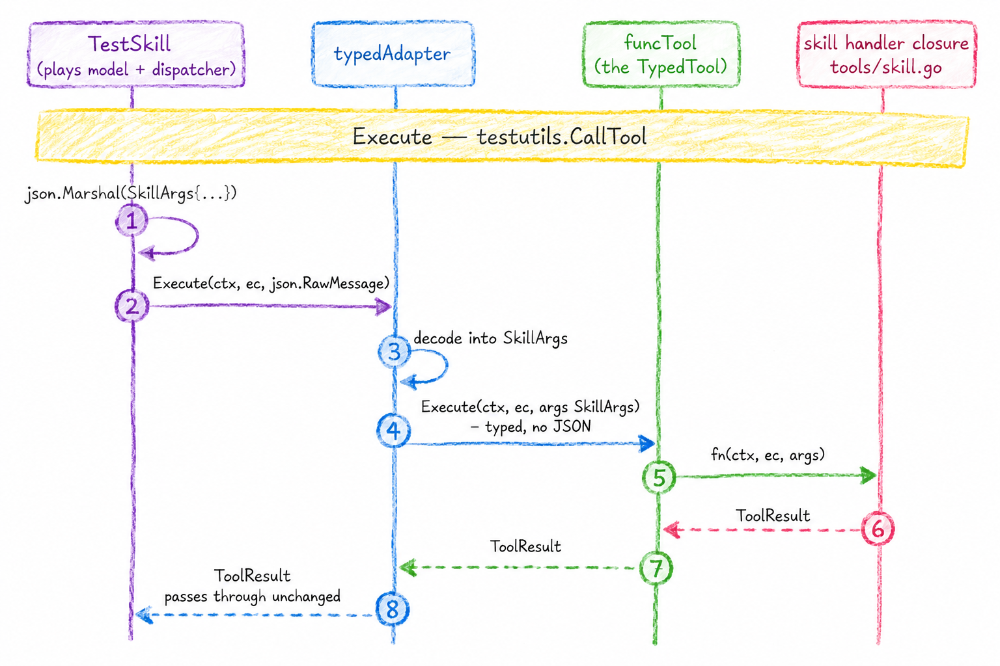

---
authors:
- mike
tags:
- hard way
- agentic coding
- llms
date: 2026-07-21
---

# Agent the Hard Way: Skills and Tools

Implementing Agent Skills as a tool.

## Intro

I decided to implement [Agent Skills](https://agentskills.io/), or shortly skills from now on, as a tool. Because [everything is a tool](https://maik.fi/blog/09-agent-the-hard-way-3.html). This blog post does not spend too much time talking about skills themselves, they are pretty simple things. Most skills out in the nature don't actually have anything else than a `SKILL.md` and that is fine, skills are still useful! Frontier models are extremely good at following instructions given in skills, they are simple yet effective.

## Supporting Skills

Antropic originally _developed_ Agent Skills and then made it into an open standard (of sorts). The official site has instructions how to [add support for skills into an agent](https://agentskills.io/client-implementation/adding-skills-support). It describes 5 steps (at the time of reading):

1. Discover skills
2. Parse SKILL.md files
3. Disclose available skills to the model
4. Activate skills
5. Manage skill context over time

Out of these five we will not actually have to implement the parsing nor discovery, at least for now. It's not a thing for a specialised agent as we will see. Also I don't think there is a need to implement the last step until compaction is introduced. Compaction is definitely a topic of it's own. So we will implement these:

3. Disclose available skills to the model
4. Activate skills


We will use the dedicated `skill` tool to do these both. In the description of the tool we will provide the list of available skills because we anyways need those skills to be passed when creating this tool. This will make the implementation more straight forward because we don't need the skills to go into the system prompt, and worry if we use this tool or not. If we have skills, we should use this tool.


## Skill list

In our description we include the list of available skills in the XML format:

```xml
<available_skills>
  <skill>
    <name>pdf-processing</name>
    <description>Extract PDF text, fill forms, merge files. Use when handling PDFs.</description>
    <location>/home/user/.agents/skills/pdf-processing/SKILL.md</location>
  </skill>
  <skill>
    <name>data-analysis</name>
    <description>Analyze datasets, generate charts, and create summary reports.</description>
    <location>/home/user/project/.agents/skills/data-analysis/SKILL.md</location>
  </skill>
</available_skills>
```

The page mentions that when using a dedicated activation tool (which we are) then the `location` can be omitted, so we'll omit that and provide simply the `name` and `description` fields. We'll do that. No `location`.

I have to admit, it feels _verbose_ to use the XML format in the tool description somehow compared to having it in the system prompts. That's just me I guess. I'm thinking this still lands "early enough" in the context window so that the LLM shouldn't forget it, as they [tend to forget things in the "middle"](https://direct.mit.edu/tacl/article/doi/10.1162/tacl_a_00638/119630/Lost-in-the-Middle-How-Language-Models-Use-Long). Although obviously tools are a larger list later in the context than the system prompt. Because the agentskills.io guide says this is fine, let's roll with it.

## Skill Tool

For reference, Claude Code `Skill` tool definition looks like this:

```json
{
  "name": "Skill",
  "description": "Execute a skill within the main conversation\n\nWhen users ask you to perform tasks, check if any of the available skills match. Skills provide specialized capabilities and domain knowledge.\n\nWhen users reference a \"slash command\" or \"/<something>\", they are referring to a skill. Use this tool to invoke it.\n\nHow to invoke:\n- Set `skill` to the exact name of an available skill (no leading slash). For plugin-namespaced skills use the fully qualified `plugin:skill` form.\n- Set `args` to pass optional arguments.\n- Some skills are scoped to a directory: their name is prefixed with the directory (e.g. `apps/web:deploy`) and their description says which directory they apply to. When a skill name has both a scoped and an unscoped variant, pick by the files you are working on: if the files are under a variant's directory, invoke that variant (most specific directory wins); otherwise invoke the unscoped one.\n\nImportant:\n- Available skills are listed in system-reminder messages in the conversation\n- Only invoke a skill that appears in that list, or one the user explicitly typed as `/<name>` in their message. Never guess or invent a skill name from training data; otherwise do not call this tool\n- When a skill matches the user's request, this is a BLOCKING REQUIREMENT: invoke the relevant Skill tool BEFORE generating any other response about the task\n- NEVER mention a skill without actually calling this tool\n- Do not invoke a skill that is already running\n- Do not use this tool for built-in CLI commands (like /help, /clear, etc.)\n- If you see a <command-name> tag in the current conversation turn, the skill has ALREADY been loaded - follow the instructions directly instead of calling this tool again\n",
  "input_schema": {
    "$schema": "https://json-schema.org/draft/2020-12/schema",
    "type": "object",
    "properties": {
      "skill": {
        "description": "The name of a skill from the available-skills list. Do not guess names.",
        "type": "string"
      },
      "args": {
        "description": "Optional arguments for the skill",
        "type": "string"
      }
    },
    "required": [
      "skill"
    ],
    "additionalProperties": false
  },
  "eager_input_streaming": true
}
```

The description talks about slash commands and directories etc. I don't think everything here will be useful in our context. But there are some pretty interesting parts in the description we could borrow I suppose. Not sure will we do anything with the optional `args` input field, but I think something like that might be genuinely useful sometimes so we can keep it.

The website also [suggests](https://agentskills.io/client-implementation/adding-skills-support#structured-wrapping) that we should return the skill activation result in the same sort of xml format as the skill catalog:

```xml
<skill_content name="pdf-processing">
# PDF Processing

## When to use this skill
Use this skill when the user needs to work with PDF files...

[rest of SKILL.md body]

Skill directory: /home/user/.agents/skills/pdf-processing
Relative paths in this skill are relative to the skill directory.

<skill_resources>
  <file>scripts/extract.py</file>
  <file>scripts/merge.py</file>
  <file>references/pdf-spec-summary.md</file>
</skill_resources>
</skill_content>
```

Sounds like a reasonable idea, so we'll do that.

## Go stuff

In a previous post we implemented a simple `current_time` tool, but that tool didn't even have any inputs it takes. That was cheating a bit honestly. Once we have tools that do have inputs then we need to do few more things because of our multi-model needs. This is a part that I'm not too proud of how it came out, it feels too complex to me, but this sort of things happen with Go from time to time (because they added generics?).

Alright, so we have a very fancy way of having type-safe inputs to different `Tool` implementations now. Here are the types:

```go
type ToolResult struct {
	Content string
	IsError bool
}

// ExecCtx is what a tool gets at call time
type ExecCtx struct {
	Session *Session
	Sandbox Sandbox
}

// Tool is the erased interface the dispatcher holds in its map[string]Tool.
type Tool interface {
	Definition() model.ToolDefinition
	Execute(ctx context.Context, ec *ExecCtx, input json.RawMessage) (ToolResult, error)
}

// ToolMeta is the name and description a typed tool declares
type ToolMeta struct {
	Name        string
	Description string
}

// TypedTool is what tool authors implement. Args are JSON-decoded and validated
// against the derived schema by Adapt before Execute runs
type TypedTool[T any] interface {
	Meta() ToolMeta
	Execute(ctx context.Context, ec *ExecCtx, args T) (ToolResult, error)
}
```

Alright so I will try to briefly explain what is going on. For full details I will leave this [TOOLS.md](https://github.com/maikdotfi/metaharness/blob/9b8bd70b11bc9eecba9a96c0b66be5e6b7d39cce/TOOLS.md) file into the repo, but that is verbose and mostly LLM generated to be fairly exhaustive in every way possible. I'll quickly cover the bits that feel important below.

We have a `Tool` interface, this has an `Execute` method that takes a `input` of type `json.RawMessage` (which is just a slice of bytes). But we also have another interface called `TypedTool` which uses generics.

While we can implement tools using simply by implementing the `Tool` interface, we can also now create typed tools:

```go
type Bash struct{}

type BashArgs struct {
	Cmd string `json:"cmd" description:"The shell command to run."`
}

func (Bash) Meta() agent.ToolMeta {
	return agent.ToolMeta{
		Name:        "bash",
		Description: "Run a shell command in the sandbox.",
	}
}

func (Bash) Execute(ctx context.Context, ec *agent.ExecCtx, args BashArgs) (agent.ToolResult, error) {
	res, err := ec.Sandbox.Exec(ctx, agent.Command{Cmd: "bash", Args: []string{"-c", args.Cmd}})
	if err != nil {
		return agent.ToolResult{}, err // infra failure -> fatal
	}
	out := res.Stdout
	if res.Stderr != "" {
		out += "\n" + res.Stderr
	}
	return agent.ToolResult{Content: out, IsError: res.ExitCode != 0}, nil
}
```

Note that our tool types all live in the `agent` pkg, but the tools live in `tools` pkg.

The `Bash` tool above is a `TypedTool` because the third argument for the `Execute` method isn't simply a `json.RawMessage`.

You implement the type yourself if you want methods or other things beyond a single function for the tool. In fact, the bash tool should really use the easy way, but I wanted to show the same example here.

As said, you can implement simple tools also in an easier way using this helper function:

```go
func AdaptFunc[T any](
	meta ToolMeta,
	fn func(ctx context.Context, ec *ExecCtx, args T) (ToolResult, error),
) Tool {
	return Adapt(funcTool[T]{meta: meta, fn: fn})
}
```

This takes in `any` type that we want to wrap, and returns a valid `Tool` interface. Only thing we need to really write is the closure (function) that is _adapted_ into a `TypedTool`.

The `Adapt` generic function wraps the original type (`funcTool`), storing it in the `inner` field which is where we can find our closure for execution:

```go
func Adapt[T any](inner TypedTool[T]) Tool {
	return &typedAdapter[T]{
		inner:  inner,
		schema: schema.Generate(reflect.TypeFor[T]()),
	}
}
```

What it actually returns is a `typedAdapter` in the end which has holds a schema that is generated based on reflection.

The `funcTool` type is kinda like necessary evil that we don't even think about, it allows our simple passed in function to grow in to a full type basically. I don't really feel like writing about this more, it is what it is.

Our implementation looks like this if we skip some long lines:

```go
func NewSkill(available ...skills.Skill) agent.Tool {
	byName := make(map[string]skills.Skill, len(available))
	names := make([]string, 0, len(available))
	for _, s := range available {
		byName[s.Name] = s
		names = append(names, s.Name)
	}

	meta := agent.ToolMeta{
		Name:        "skill",
		Description: skillDescription + "\n\n" + renderCatalog(available),
	}

	return agent.AdaptFunc(meta,
		func(ctx context.Context, ec *agent.ExecCtx, args SkillArgs) (agent.ToolResult, error) {
			s, ok := byName[args.Name]
			if !ok {
				// Name the valid options so the model can self-correct on the
				// next turn instead of retrying blind.
				return agent.ToolResult{
					Content: fmt.Sprintf("unknown skill %q; available skills: %s", args.Name, strings.Join(names, ", ")),
					IsError: true,
				}, nil
			}
			// The wrapper matches the shape promised in the tool description,
			// and its name attribute is what lets a later turn recognize the
			// skill as already loaded.
			var b strings.Builder
			fmt.Fprintf(&b, "<skill_content name=%q>\n%s\n", s.Name, strings.TrimRight(s.Instructions, "\n"))
			if args.Args != "" {
				fmt.Fprintf(&b, "\nArguments passed to the skill: %s\n", args.Args)
			}
			b.WriteString("</skill_content>")
			return agent.ToolResult{Content: b.String()}, nil
		},
	)
}
```

The `NewSkill` function is the one we call and pass in all the agent skills we want. There can be a separate `skills` package that holds all the skills, but time being basically we ware limited to just providing extra instructions as a skill. There is no way the skill becomes files, no scripts or links to additional files possible because nothing is written to a filesystem (atm).

## Tool Execution

So we can create a skill inside a test and call the tool:

```go
func TestSkill(t *testing.T) {
	ec, _ := testutils.NewExecCtx(t)
	pirate := skills.Skill{
		Name:         "pirate_greeting",
		Description:  "Greet the user in pirate speak.",
		Instructions: "Always open with 'Ahoy!' and close with 'Yarr.'",
	}
	tool := NewSkill(pirate)

	wantCatalog := `<available_skills>
  <skill>
    <name>pirate_greeting</name>
    <description>Greet the user in pirate speak.</description>
  </skill>
</available_skills>`

	def := tool.Definition()
	if !strings.Contains(def.Description, wantCatalog) {
		t.Errorf("tool description missing catalog block %q, got %q", wantCatalog, def.Description)
	}
	t.Logf("\nDescription: \n\n%s", def.Description)

	res := testutils.CallTool(t, ec, tool, SkillArgs{
		Name: "pirate_greeting",
		Args: "the user is named Bob",
	})
	if res.IsError {
		t.Fatalf("unexpected error: %q", res.Content)
	}
ó
	want := `<skill_content name="pirate_greeting">
Always open with 'Ahoy!' and close with 'Yarr.'

Arguments passed to the skill: the user is named Bob
</skill_content>`
ó	if res.Content != want {
		t.Errorf("Content = %q, want %q", res.Content, want)
	}
	t.Logf("\nContent: \n\n%s", res.Content)
}
```


The path to execute the (typed!) tool is a bit convoluted:



As we can see the `TypedTool` will call the closure. But before that the adapter also does some more checks:

```go
func (a *typedAdapter[T]) Execute(ctx context.Context, ec *ExecCtx, input json.RawMessage) (ToolResult, error) {
	// Validate against the schema first so missing required fields, bad enums,
	// and out-of-range numbers become a clear message fed back to the model
	// rather than silent Go zero values.
	var obj any
	if err := json.Unmarshal(input, &obj); err != nil {
		return ToolResult{
			Content: "invalid arguments: " + err.Error(),
			IsError: true,
		}, nil
	}
	if err := schema.ValidateAgainstSchema(obj, a.schema); err != nil {
		return ToolResult{
			Content: "invalid arguments: " + err.Error(),
			IsError: true,
		}, nil
	}

	var args T
	if err := json.Unmarshal(input, &args); err != nil {
		return ToolResult{
			Content: "invalid arguments: " + err.Error(),
			IsError: true,
		}, nil
	}
	return a.inner.Execute(ctx, ec, args)
}
```

This is the `Execute` that wraps the `inner.Execute`. These checks will hopefully prove useful to avoid even actually executing our tool if the input is bogus. We will return context that is hopefully helpful for the LLM to correct the inputs, even before execution of the actual tool. This is main motivation why I decided to introduce this extra typing.

Just yesterday I had a coding harness trying to read a file I mentioned via `@` where it replaced a `_` in the name with a `-`, which meant it had to list the files again to realise it's mistake (the tool call could have returned something like "did you mean?" - but it didn't, funny thought?).

Small subtle errors are a thing with these LLMs when they generate text. Although this model wasn't Opus or similar bleeding edge frontier one, but still a very good one (IIRC GLM-5.2 was the open weight model in question). While this happened in the argument instead of in the input schema itself, I don't think there is a difference really to the LLM. This experience makes all this extra complexity feel like **it's not YAGNI**, although I feel some of these things done by the machinery can definitely be just handled by writing couple tests.

## One Final Tangent

It's pretty tiring to read the agentskills.io website when the text is full of em dashes and overall the text is just so... plain. Some of the em dashes just feel sort of force fed by the LLM, like this one:

> Other scopes are possible too — for example, organization-wide skills deployed by an admin, or skills bundled with the agent itself.

However, all the information is in there so I can't complain too much. It's just not very well and concisely presented IMO. I'm very much against having people read something you don't bother writing, but that does not mean you cannot use LLMs to help you write. I'm absolutely fine with that, as long as the text isn't by and large generated..

## Conclusion

The skill tool itself isn't that complex really, just had to do some extra stuff. I've also at the same time implemented the other "core" tools like `bash`, `read_file` and `edit_file`, but I found there is not much to write home about those. For this post the code is [here](https://github.com/maikdotfi/metaharness/blob/9b8bd70b11bc9eecba9a96c0b66be5e6b7d39cce/tools/skill.go) (a commit at the time).

Next I think we'll run an agent for real and talk about putting the things built so far together. All the glue has kinda been visible the whole time in function signatures, but I haven't covered those parts yet.

